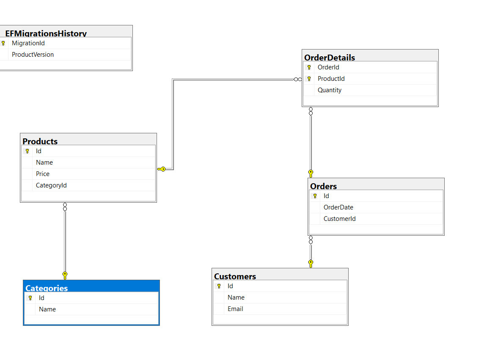
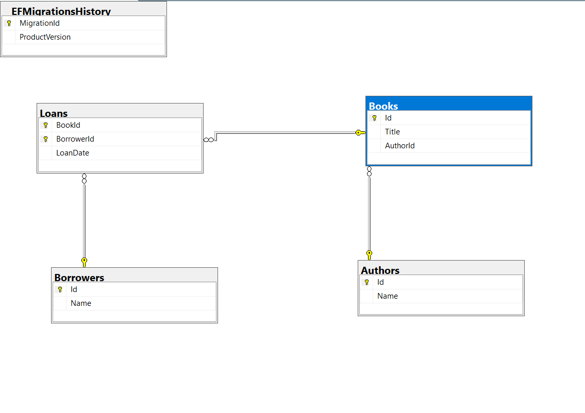
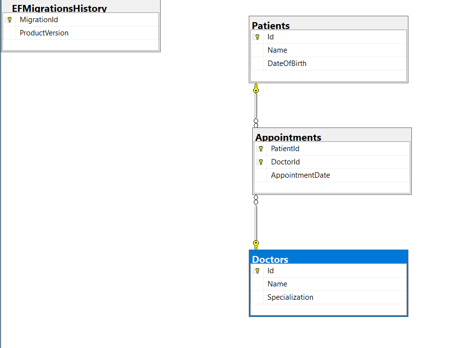

# EF Core Assignment 02 - Multi-DbContext Architecture

This repository contains a full-stack .NET implementation of three independent relational database systems built using **Entity Framework Core (Code First)**.

## 📌 Projects Included

1. **E-commerce System** (`ECommerceDbContext` -> `ECommerceDb`)
   - Entities: `Category`, `Product`, `Customer`, `Order`, `OrderDetail`.
   - Relationships: One-to-Many (Category-Product, Customer-Order), Many-to-Many via Join Table (Order-Product through OrderDetail).

2. **Library Management System** (`LibraryDbContext` -> `LibraryDb`)
   - Entities: `Author`, `Book`, `Borrower`, `Loan`.
   - Relationships: One-to-Many (Author-Book), Many-to-Many via Join Table (Book-Borrower through Loan).

3. **Health Care System** (`HealthCareDbContext` -> `HealthCareDb`)
   - Entities: `Patient`, `Doctor`, `Appointment`.
   - Relationships: Many-to-Many via Join Table with Composite Key (Patient-Doctor through Appointment).

---

## 🛠️ Tech Stack & Architecture
- **Framework:** .NET Core / EF Core
- **Approach:** Code First (Fluent API & Data Annotations)
- **Database:** SQL Server
- **IDE:** Visual Studio

---

## 📐 Database Diagrams

### 1. E-Commerce Database Diagram

### 2. Library Database Diagram

### 3. Health Care Database Diagram

